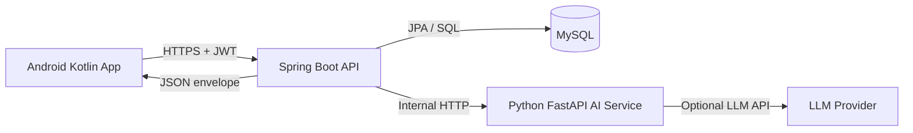
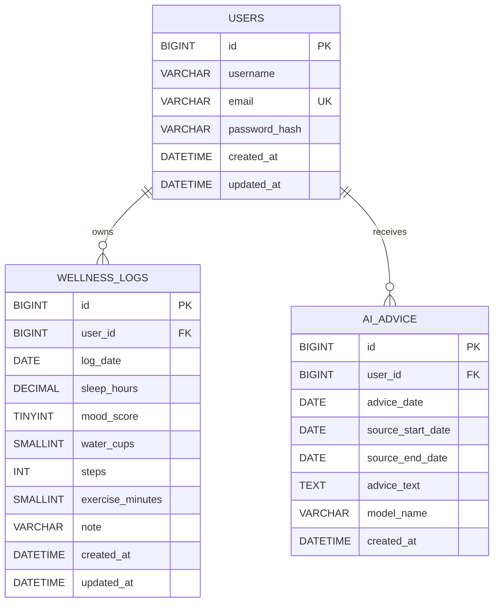

# SimpleWell Spring Boot Backend Research Report

## Executive summary

The uploaded project document defines a deliberately small wellness platform: an Android Kotlin client talks to a Spring Boot backend over JWT-secured HTTP, and the backend calls a Python FastAPI service to generate non-medical wellness advice from daily logs. The workshop file reinforces two implementation requirements that matter most for the backend: exposing LLM functionality through FastAPI and securing Android-to-backend access with JWT. This report therefore keeps the backend scope tightly aligned to that MVP and fills in the implementation details that the project file leaves open, especially around schema design, endpoint behaviour, pagination, ownership checks, error handling, and deployment hardening. fileciteturn0file0 fileciteturn0file1

The main design recommendation is to keep the public backend lean and durable: use three core domain tables (`users`, `wellness_logs`, `ai_advice`), enforce one log per user per day with a unique constraint, keep the Python AI service internal-only, and expose a stable JSON envelope to the Android client. The schema below targets MySQL 8.x with InnoDB for transactions and foreign keys, uses CHECK constraints for field sanity, and adds only a small amount of implementation metadata beyond the project file, namely the AI request window and the model name used to generate advice. Those additions are internal and do not change the public contract. fileciteturn0file0 citeturn7view3turn7view0turn7view1turn7view2

For security and operational simplicity, the most practical MVP is short-lived access tokens only, sent in the `Authorization: Bearer ...` header, with no refresh-token flow because none is specified in the project file. JWT handling should validate algorithm, issuer, audience, signature, and expiry, and it should include `iat`, `exp`, and `jti`; secret rotation, logout, and token revocation remain open because the supplied project does not define them. Password hashing should use adaptive one-way hashing. In a simple Spring Boot student build, `DelegatingPasswordEncoder` with bcrypt is the lowest-friction default; if you are willing to add the extra dependency and tuning effort, Argon2 is stronger and is preferred by OWASP for new systems. fileciteturn0file0 citeturn3view2turn3view0turn3view1turn9view2turn9view3turn9view4turn9view0turn23view2turn23view3turn23view0turn18view3turn18view4

## Architecture and data model

The provided project file defines the core system flow very clearly: Android stores the JWT locally, Spring Boot owns authentication and persistence, and the Python FastAPI service is called by Spring Boot rather than by the mobile client directly. That separation is worth preserving because it centralises identity, ownership checks, and database access in one place. fileciteturn0file0



A few implementation assumptions are intentionally treated as open. The project file does **not** define logout, refresh tokens, role hierarchies, password reset, email verification, device management, or secret rotation policy. This report therefore assumes a single `USER` role, access-token-only JWT, and no token revocation list in the MVP. If you later add logout or forced invalidation, you should introduce a `jti` deny-list or versioned-token strategy; for the current project, that complexity is optional rather than required. fileciteturn0file0 citeturn9view3

The schema uses InnoDB because MySQL documents it as the default transaction-safe engine with row locking and foreign-key support. It also uses a root-package, domain-oriented code layout because Spring Boot recommends placing the main application class in a root package above the rest of the application so that component scanning and entity discovery remain constrained to the project itself. citeturn7view3turn16view1



The table design below is chosen to satisfy the project file’s concrete data requirements for users, wellness logs, and AI advice, while fixing several omissions that matter in production-like code: one log per user per date, strict ownership via foreign keys, finite numeric ranges, and indexed access paths for the list and “latest advice” calls. MySQL requires indexes on foreign keys and referenced keys for efficient foreign-key checks, and unique constraints remain the right mechanism for enforcing one-daily-log-per-user semantics. CHECK constraints are also evaluated for `INSERT` and `UPDATE`, so they are useful here for domain sanity as long as they are kept away from foreign-key columns that use referential actions. fileciteturn0file0 citeturn7view1turn7view2turn7view0

### Schema summary

| Table | Purpose | Key constraints | Important indexes |
|---|---|---|---|
| `users` | Application identities | `PRIMARY KEY(id)`, `UNIQUE(email)` | `uq_users_email` |
| `wellness_logs` | One daily wellness record per user | `FOREIGN KEY(user_id)`, `UNIQUE(user_id, log_date)` | `(user_id, log_date)`, `(log_date)` |
| `ai_advice` | Persisted AI output returned to Android | `FOREIGN KEY(user_id)` | `(user_id, created_at)`, `(user_id, advice_date)` |

### Runnable MySQL DDL and seed script

This script is designed for MySQL 8.x. It uses `utf8mb4`, InnoDB, explicit indexes, CHECK constraints for data quality, and seed data that matches the project that you uploaded. The seed users use Spring Security’s `{bcrypt}` password storage format, and the sample password for both demo users is `password`. fileciteturn0file0 citeturn3view2turn7view3turn7view0

```sql
CREATE DATABASE IF NOT EXISTS simplewell
  CHARACTER SET utf8mb4
  COLLATE utf8mb4_unicode_ci;

USE simplewell;

SET NAMES utf8mb4;

DROP TABLE IF EXISTS ai_advice;
DROP TABLE IF EXISTS wellness_logs;
DROP TABLE IF EXISTS users;

CREATE TABLE users (
    id BIGINT UNSIGNED NOT NULL AUTO_INCREMENT,
    username VARCHAR(50) NOT NULL,
    email VARCHAR(254) NOT NULL,
    password_hash VARCHAR(255) NOT NULL,
    created_at DATETIME(3) NOT NULL DEFAULT CURRENT_TIMESTAMP(3),
    updated_at DATETIME(3) NOT NULL DEFAULT CURRENT_TIMESTAMP(3) ON UPDATE CURRENT_TIMESTAMP(3),

    CONSTRAINT pk_users PRIMARY KEY (id),
    CONSTRAINT uq_users_email UNIQUE (email),
    CONSTRAINT chk_users_username_len CHECK (CHAR_LENGTH(username) BETWEEN 3 AND 50),
    CONSTRAINT chk_users_email_len CHECK (CHAR_LENGTH(email) BETWEEN 5 AND 254),
    CONSTRAINT chk_users_password_hash_len CHECK (CHAR_LENGTH(password_hash) BETWEEN 20 AND 255)
) ENGINE=InnoDB
  DEFAULT CHARSET=utf8mb4
  COLLATE=utf8mb4_unicode_ci;

CREATE TABLE wellness_logs (
    id BIGINT UNSIGNED NOT NULL AUTO_INCREMENT,
    user_id BIGINT UNSIGNED NOT NULL,
    log_date DATE NOT NULL,
    sleep_hours DECIMAL(4,2) NULL,
    mood_score TINYINT UNSIGNED NULL,
    water_cups SMALLINT UNSIGNED NULL,
    steps INT UNSIGNED NULL,
    exercise_minutes SMALLINT UNSIGNED NULL,
    note VARCHAR(1000) NULL,
    created_at DATETIME(3) NOT NULL DEFAULT CURRENT_TIMESTAMP(3),
    updated_at DATETIME(3) NOT NULL DEFAULT CURRENT_TIMESTAMP(3) ON UPDATE CURRENT_TIMESTAMP(3),

    CONSTRAINT pk_wellness_logs PRIMARY KEY (id),
    CONSTRAINT uq_wellness_logs_user_date UNIQUE (user_id, log_date),
    CONSTRAINT fk_wellness_logs_user
        FOREIGN KEY (user_id) REFERENCES users(id)
        ON DELETE CASCADE
        ON UPDATE RESTRICT,

    CONSTRAINT chk_wellness_sleep_hours
        CHECK (sleep_hours IS NULL OR (sleep_hours >= 0 AND sleep_hours <= 24)),
    CONSTRAINT chk_wellness_mood_score
        CHECK (mood_score IS NULL OR (mood_score BETWEEN 1 AND 5)),
    CONSTRAINT chk_wellness_water_cups
        CHECK (water_cups IS NULL OR water_cups <= 100),
    CONSTRAINT chk_wellness_steps
        CHECK (steps IS NULL OR steps <= 1000000),
    CONSTRAINT chk_wellness_exercise_minutes
        CHECK (exercise_minutes IS NULL OR exercise_minutes <= 1440)
) ENGINE=InnoDB
  DEFAULT CHARSET=utf8mb4
  COLLATE=utf8mb4_unicode_ci;

CREATE INDEX idx_wellness_logs_user_date
    ON wellness_logs (user_id, log_date);

CREATE INDEX idx_wellness_logs_log_date
    ON wellness_logs (log_date);

CREATE TABLE ai_advice (
    id BIGINT UNSIGNED NOT NULL AUTO_INCREMENT,
    user_id BIGINT UNSIGNED NOT NULL,
    advice_date DATE NOT NULL,
    source_start_date DATE NULL,
    source_end_date DATE NULL,
    advice_text TEXT NOT NULL,
    model_name VARCHAR(100) NULL,
    created_at DATETIME(3) NOT NULL DEFAULT CURRENT_TIMESTAMP(3),

    CONSTRAINT pk_ai_advice PRIMARY KEY (id),
    CONSTRAINT fk_ai_advice_user
        FOREIGN KEY (user_id) REFERENCES users(id)
        ON DELETE CASCADE
        ON UPDATE RESTRICT,

    CONSTRAINT chk_ai_advice_text_len
        CHECK (CHAR_LENGTH(advice_text) BETWEEN 1 AND 5000),
    CONSTRAINT chk_ai_advice_window
        CHECK (
            (source_start_date IS NULL AND source_end_date IS NULL)
            OR
            (source_start_date IS NOT NULL AND source_end_date IS NOT NULL AND source_start_date <= source_end_date)
        ),
    CONSTRAINT chk_ai_advice_model_name_len
        CHECK (model_name IS NULL OR CHAR_LENGTH(model_name) BETWEEN 1 AND 100)
) ENGINE=InnoDB
  DEFAULT CHARSET=utf8mb4
  COLLATE=utf8mb4_unicode_ci;

CREATE INDEX idx_ai_advice_user_created_at
    ON ai_advice (user_id, created_at);

CREATE INDEX idx_ai_advice_user_advice_date
    ON ai_advice (user_id, advice_date);

-- Seed users
-- Sample password for both rows: password
INSERT INTO users (id, username, email, password_hash, created_at, updated_at) VALUES
(1, 'Dadao', 'dadao@example.com', '{bcrypt}$2a$10$dXJ3SW6G7P50lGmMkkmwe.20cQQubK3.HZWzG3YB1tlRy.fqvM/BG', '2026-06-20 09:00:00.000', '2026-06-20 09:00:00.000'),
(2, 'Alice', 'alice@example.com', '{bcrypt}$2a$10$dXJ3SW6G7P50lGmMkkmwe.20cQQubK3.HZWzG3YB1tlRy.fqvM/BG', '2026-06-20 09:10:00.000', '2026-06-20 09:10:00.000');

-- Seed wellness logs
INSERT INTO wellness_logs (
    id, user_id, log_date, sleep_hours, mood_score, water_cups, steps, exercise_minutes, note, created_at, updated_at
) VALUES
(101, 1, '2026-06-20', 7.50, 4, 6, 8200, 30, 'Felt good overall.', '2026-06-20 20:00:00.000', '2026-06-20 20:00:00.000'),
(102, 1, '2026-06-21', 6.75, 3, 5, 6000, 20, 'A bit tired in the afternoon.', '2026-06-21 20:00:00.000', '2026-06-21 20:00:00.000'),
(103, 1, '2026-06-22', 7.25, 4, 7, 9100, 35, 'Good focus today.', '2026-06-22 20:00:00.000', '2026-06-22 20:00:00.000'),
(104, 1, '2026-06-23', 5.80, 2, 4, 4200, 10, 'Poor sleep and low energy.', '2026-06-23 20:00:00.000', '2026-06-23 20:00:00.000'),
(105, 1, '2026-06-24', 7.90, 5, 8, 10050, 40, 'Best day this week.', '2026-06-24 20:00:00.000', '2026-06-24 20:00:00.000'),
(106, 1, '2026-06-25', 7.10, 4, 6, 8400, 25, 'Stable routine.', '2026-06-25 20:00:00.000', '2026-06-25 20:00:00.000'),
(107, 1, '2026-06-26', 6.90, 4, 6, 7600, 30, 'Felt okay.', '2026-06-26 20:00:00.000', '2026-06-26 20:00:00.000'),
(201, 2, '2026-06-24', 8.10, 4, 7, 7200, 20, 'Pretty balanced day.', '2026-06-24 18:00:00.000', '2026-06-24 18:00:00.000'),
(202, 2, '2026-06-25', 7.80, 5, 8, 8500, 45, 'Very productive.', '2026-06-25 18:00:00.000', '2026-06-25 18:00:00.000');

-- Seed AI advice
INSERT INTO ai_advice (
    id, user_id, advice_date, source_start_date, source_end_date, advice_text, model_name, created_at
) VALUES
(1001, 1, '2026-06-26', '2026-06-20', '2026-06-26',
 'Your overall routine looks stable, but your low-sleep day on 2026-06-23 appears to have affected mood and activity. Try protecting sleep consistency and increasing water intake on busy days.',
 'simplewell-rule-based-v1', '2026-06-26 21:00:00.000'),
(1002, 2, '2026-06-25', '2026-06-24', '2026-06-25',
 'Your recent pattern looks healthy and active. Keep your sleep schedule regular and continue moderate exercise.',
 'simplewell-rule-based-v1', '2026-06-25 19:00:00.000');
```

## API contract

The uploaded project file lists ten public Spring Boot endpoints and one internal FastAPI endpoint. The contract below preserves all of those paths and responsibilities, but it tightens the details that are currently implicit: formal request schemas, validation rules, pagination, ownership behaviour, security headers, and error codes. For list endpoints, the report recommends a custom page DTO instead of serialising Spring Data `PageImpl` directly, because Spring Data explicitly warns that returning raw `Page` implementations is unstable for external JSON contracts. fileciteturn0file0 citeturn3view4

### Common request and response rules

All request bodies are JSON with `Content-Type: application/json`. Clients should send `Accept: application/json`. Protected endpoints require `Authorization: Bearer <JWT>`. An optional `X-Request-Id` header is useful for tracing and should be echoed into logs. Login and registration responses, and ideally all authenticated responses that include personal wellness data, should include `Cache-Control: no-store`. In production, serve everything over HTTPS. fileciteturn0file0 citeturn18view1

#### Success envelope

```json
{
  "success": true,
  "message": "Success",
  "data": {}
}
```

#### Error envelope

```json
{
  "success": false,
  "message": "Validation failed",
  "errorCode": "VALIDATION_ERROR",
  "errors": [
    {
      "field": "email",
      "message": "must be a well-formed email address"
    }
  ]
}
```

### Reusable schemas

| Schema | Shape |
|---|---|
| `RegisterRequest` | `{ "username": string(3..50), "email": email, "password": string(8..72 for bcrypt-based MVP) }` |
| `LoginRequest` | `{ "email": email, "password": string }` |
| `UserDto` | `{ "id": integer, "username": string, "email": email }` |
| `LoginData` | `{ "token": string, "tokenType": "Bearer", "expiresAt": date-time, "user": UserDto }` |
| `WellnessLogCreateRequest` | `{ "logDate": date, "sleepHours": number|null, "moodScore": integer|null, "waterCups": integer|null, "steps": integer|null, "exerciseMinutes": integer|null, "note": string|null }` |
| `WellnessLogUpdateRequest` | same as create request, except `logDate` omitted |
| `WellnessLogDto` | `{ "id": integer, "logDate": date, "sleepHours": number|null, "moodScore": integer|null, "waterCups": integer|null, "steps": integer|null, "exerciseMinutes": integer|null, "note": string|null, "createdAt": date-time, "updatedAt": date-time }` |
| `WellnessLogPageDto` | `{ "content": WellnessLogDto[], "page": { "number": integer, "size": integer, "totalElements": integer, "totalPages": integer, "sort": string[] } }` |
| `WeeklySummaryDto` | `{ "startDate": date, "endDate": date, "daysWithLogs": integer, "averageSleepHours": number, "averageMoodScore": number, "averageWaterCups": number, "totalSteps": integer, "totalExerciseMinutes": integer, "summary": string }` |
| `GenerateAiAdviceRequest` | `{ "startDate": date, "endDate": date }` |
| `AiAdviceDto` | `{ "id": integer, "adviceDate": date, "startDate": date|null, "endDate": date|null, "adviceText": string, "modelName": string|null, "createdAt": date-time }` |

### Error code catalogue

| Error code | Typical HTTP status | Meaning |
|---|---:|---|
| `VALIDATION_ERROR` | 400 | JSON shape or field validation failed |
| `MALFORMED_JSON` | 400 | Request body is not valid JSON |
| `INVALID_CREDENTIALS` | 401 | Email/password mismatch |
| `UNAUTHORIZED` | 401 | Missing, expired, or invalid JWT |
| `FORBIDDEN` | 403 | Authenticated but not permitted |
| `EMAIL_ALREADY_EXISTS` | 409 | Registration email already in use |
| `WELLNESS_LOG_ALREADY_EXISTS` | 409 | User already has a log for that date |
| `RESOURCE_NOT_FOUND` | 404 | Requested entity absent, or hidden due to ownership rules |
| `INVALID_DATE_RANGE` | 400 | `startDate > endDate` or partial date range where both are required |
| `NO_AI_ADVICE_FOUND` | 404 | No advice exists for that user yet |
| `AI_SERVICE_UNAVAILABLE` | 503 | FastAPI/LLM call failed or timed out |
| `RATE_LIMIT_EXCEEDED` | 429 | Request rejected by throttling rule |
| `UNSUPPORTED_MEDIA_TYPE` | 415 | Non-JSON request where JSON is required |
| `METHOD_NOT_ALLOWED` | 405 | HTTP method outside the allow-list |

### Endpoint catalogue

#### Auth and profile endpoints

| Method | Path | Auth | Request schema | Success | Errors | Notes |
|---|---|---|---|---|---|---|
| `POST` | `/api/auth/register` | No | `RegisterRequest` | `201 Created`, `ApiSuccess<UserDto>` | `400`, `409`, `415`, `429` | Server should normalise email to lower-case before uniqueness check |
| `POST` | `/api/auth/login` | No | `LoginRequest` | `200 OK`, `ApiSuccess<LoginData>` | `400`, `401`, `415`, `429` | Return `WWW-Authenticate: Bearer` on `401` |
| `GET` | `/api/users/me` | Yes | none | `200 OK`, `ApiSuccess<UserDto>` | `401` | Uses current principal from JWT |

**`POST /api/auth/register` example**

Request:
```json
{
  "username": "Dadao",
  "email": "dadao@example.com",
  "password": "Password123"
}
```

Response:
```json
{
  "success": true,
  "message": "User registered successfully",
  "data": {
    "id": 1,
    "username": "Dadao",
    "email": "dadao@example.com"
  }
}
```

**`POST /api/auth/login` example**

Request:
```json
{
  "email": "dadao@example.com",
  "password": "Password123"
}
```

Response:
```json
{
  "success": true,
  "message": "Login successful",
  "data": {
    "token": "eyJhbGciOiJIUzI1NiIsInR5cCI6IkpXVCJ9...",
    "tokenType": "Bearer",
    "expiresAt": "2026-06-27T14:00:00Z",
    "user": {
      "id": 1,
      "username": "Dadao",
      "email": "dadao@example.com"
    }
  }
}
```

**`GET /api/users/me` example**

Response:
```json
{
  "success": true,
  "message": "Success",
  "data": {
    "id": 1,
    "username": "Dadao",
    "email": "dadao@example.com"
  }
}
```

#### Wellness log and summary endpoints

| Method | Path | Auth | Request / query | Success | Errors | Notes |
|---|---|---|---|---|---|---|
| `POST` | `/api/wellness-logs` | Yes | `WellnessLogCreateRequest` | `201 Created`, `ApiSuccess<WellnessLogDto>` | `400`, `401`, `409`, `415`, `429` | One record per user per `logDate` |
| `GET` | `/api/wellness-logs` | Yes | `startDate?`, `endDate?`, `page=0`, `size=20`, `sort=logDate,desc` | `200 OK`, `ApiSuccess<WellnessLogPageDto>` | `400`, `401`, `429` | `page` is 0-indexed; max `size` recommended 100 |
| `GET` | `/api/wellness-logs/date/{logDate}` | Yes | path `logDate` | `200 OK`, `ApiSuccess<WellnessLogDto>` | `400`, `401`, `404` | Date must be ISO `yyyy-MM-dd` |
| `PUT` | `/api/wellness-logs/{id}` | Yes | `WellnessLogUpdateRequest` | `200 OK`, `ApiSuccess<WellnessLogDto>` | `400`, `401`, `404`, `415`, `429` | If record is not owned by caller, return `404` rather than leak existence |
| `DELETE` | `/api/wellness-logs/{id}` | Yes | none | `200 OK`, `ApiSuccess<null>` | `401`, `404`, `429` | Same ownership rule as update |
| `GET` | `/api/wellness-summary/weekly` | Yes | `startDate?`, `endDate?` | `200 OK`, `ApiSuccess<WeeklySummaryDto>` | `400`, `401`, `429` | If both are omitted, default to trailing 7 days inclusive |

**`POST /api/wellness-logs` example**

Request:
```json
{
  "logDate": "2026-06-24",
  "sleepHours": 7.5,
  "moodScore": 4,
  "waterCups": 6,
  "steps": 8000,
  "exerciseMinutes": 30,
  "note": "Felt good today, but a little tired in the afternoon."
}
```

Response:
```json
{
  "success": true,
  "message": "Wellness log created successfully",
  "data": {
    "id": 101,
    "logDate": "2026-06-24",
    "sleepHours": 7.5,
    "moodScore": 4,
    "waterCups": 6,
    "steps": 8000,
    "exerciseMinutes": 30,
    "note": "Felt good today, but a little tired in the afternoon.",
    "createdAt": "2026-06-24T10:30:00Z",
    "updatedAt": "2026-06-24T10:30:00Z"
  }
}
```

**`GET /api/wellness-logs` example**

`GET /api/wellness-logs?startDate=2026-06-01&endDate=2026-06-24&page=0&size=20&sort=logDate,desc`

Response:
```json
{
  "success": true,
  "message": "Success",
  "data": {
    "content": [
      {
        "id": 101,
        "logDate": "2026-06-24",
        "sleepHours": 7.5,
        "moodScore": 4,
        "waterCups": 6,
        "steps": 8000,
        "exerciseMinutes": 30,
        "note": "Felt good today.",
        "createdAt": "2026-06-24T10:30:00Z",
        "updatedAt": "2026-06-24T10:30:00Z"
      }
    ],
    "page": {
      "number": 0,
      "size": 20,
      "totalElements": 1,
      "totalPages": 1,
      "sort": ["logDate,desc"]
    }
  }
}
```

**`GET /api/wellness-logs/date/{logDate}` example**

Response:
```json
{
  "success": true,
  "message": "Success",
  "data": {
    "id": 101,
    "logDate": "2026-06-24",
    "sleepHours": 7.5,
    "moodScore": 4,
    "waterCups": 6,
    "steps": 8000,
    "exerciseMinutes": 30,
    "note": "Felt good today.",
    "createdAt": "2026-06-24T10:30:00Z",
    "updatedAt": "2026-06-24T10:30:00Z"
  }
}
```

**`PUT /api/wellness-logs/{id}` example**

Request:
```json
{
  "sleepHours": 8.0,
  "moodScore": 5,
  "waterCups": 7,
  "steps": 9000,
  "exerciseMinutes": 35,
  "note": "Updated my record."
}
```

Response:
```json
{
  "success": true,
  "message": "Wellness log updated successfully",
  "data": {
    "id": 101,
    "logDate": "2026-06-24",
    "sleepHours": 8.0,
    "moodScore": 5,
    "waterCups": 7,
    "steps": 9000,
    "exerciseMinutes": 35,
    "note": "Updated my record.",
    "createdAt": "2026-06-24T10:30:00Z",
    "updatedAt": "2026-06-24T11:00:00Z"
  }
}
```

**`DELETE /api/wellness-logs/{id}` example**

Response:
```json
{
  "success": true,
  "message": "Wellness log deleted successfully",
  "data": null
}
```

**`GET /api/wellness-summary/weekly` example**

Response:
```json
{
  "success": true,
  "message": "Success",
  "data": {
    "startDate": "2026-06-17",
    "endDate": "2026-06-24",
    "daysWithLogs": 6,
    "averageSleepHours": 7.2,
    "averageMoodScore": 4.1,
    "averageWaterCups": 6.5,
    "totalSteps": 56000,
    "totalExerciseMinutes": 180,
    "summary": "Your sleep and exercise were stable this week."
  }
}
```

#### AI endpoints

| Method | Path | Auth | Request schema | Success | Errors | Notes |
|---|---|---|---|---|---|---|
| `POST` | `/api/ai/advice` | Yes | `GenerateAiAdviceRequest` | `201 Created`, `ApiSuccess<AiAdviceDto>` | `400`, `401`, `415`, `429`, `503` | Reads DB logs, calls internal FastAPI, stores result |
| `GET` | `/api/ai/advice/latest` | Yes | none | `200 OK`, `ApiSuccess<AiAdviceDto>` | `401`, `404`, `429` | Returns latest by `created_at desc` for caller |

**`POST /api/ai/advice` example**

Request:
```json
{
  "startDate": "2026-06-17",
  "endDate": "2026-06-24"
}
```

Response:
```json
{
  "success": true,
  "message": "AI advice generated successfully",
  "data": {
    "id": 501,
    "adviceDate": "2026-06-24",
    "startDate": "2026-06-17",
    "endDate": "2026-06-24",
    "adviceText": "You slept around 7 hours per day this week, which is stable. Your exercise time is good. Try to drink slightly more water and take short breaks when you feel tired in the afternoon.",
    "modelName": "simplewell-rule-based-v1",
    "createdAt": "2026-06-24T12:00:00Z"
  }
}
```

**`GET /api/ai/advice/latest` example**

Response:
```json
{
  "success": true,
  "message": "Success",
  "data": {
    "id": 501,
    "adviceDate": "2026-06-24",
    "startDate": "2026-06-17",
    "endDate": "2026-06-24",
    "adviceText": "Try to maintain your sleep schedule and increase water intake.",
    "modelName": "simplewell-rule-based-v1",
    "createdAt": "2026-06-24T12:00:00Z"
  }
}
```

### JWT, ownership, pagination, and rate-limiting rules

JWTs should carry at least `iss`, `sub`, `aud`, `iat`, `exp`, and `jti`, and the backend should validate issuer, audience, expiry, and algorithm rather than trusting the token’s declared algorithm implicitly. RFC 7519 defines the claims, including the semantics of `exp`, `iat`, and `jti`, while RFC 8725 strengthens the rules by requiring algorithm verification and explicit issuer/audience validation. For this specific app, a sensible claim set is: `iss = "simplewell-backend"`, `sub = "<userId>"`, `aud = "simplewell-android"`, `scope = ["USER"]`, plus `iat`, `exp`, and `jti`. Because the supplied project has no refresh-token flow, a 60-minute access token is a practical MVP compromise; that duration is a recommendation, not a stated requirement in the source materials. Secret rotation policy is unspecified. fileciteturn0file0 citeturn9view2turn9view3turn9view4turn9view0turn9view1turn23view0turn23view2turn23view3turn23view1

Ownership must be enforced in the service layer on every user-owned object. Public endpoints should never accept `userId` from the client; the authenticated principal determines ownership. For `PUT /api/wellness-logs/{id}` and `DELETE /api/wellness-logs/{id}`, the safest public behaviour is to return `404` when the row either does not exist or is not owned by the current user, which avoids leaking object existence across accounts. For collection endpoints, accept only a small allow-list of sort fields. For `GET /api/wellness-logs`, use Spring Data’s default request pattern of `page`, `size`, and repeated `sort` parameters, where page numbers are 0-indexed and default size is 20; still, return your own page DTO rather than serialising `PageImpl` directly. citeturn3view4turn18view2

Rate limiting is not specified in the project file, so it should be treated as an implementation recommendation. OWASP explicitly recommends login throttling to counter password guessing. A good starting point for this app is: `/api/auth/login` at 5 failed attempts per 15 minutes per `IP + email`, `/api/auth/register` at 3 requests per hour per IP, `/api/ai/advice` at 10 requests per minute per user, write endpoints at 60 requests per minute per user, and read endpoints at 120 requests per minute per user. Whether this is enforced in Spring Boot, at the reverse proxy, or at an API gateway is left open. citeturn18view0

## Implementation roadmap

The implementation order in the project file already separates foundation, wellness features, Android integration, and AI. The branch plan below keeps that shape but makes it more concrete for a real Git workflow, with one feature branch per slice, exact deliverables, estimated effort, and a branch-level test checklist. fileciteturn0file0

### Branch overview

| Branch | Goal | Estimated duration |
|---|---|---:|
| `feature/bootstrap-mysql` | Create the Spring Boot skeleton, dependencies, config, and local MySQL wiring | 3–4 hours |
| `feature/schema-flyway` | Add SQL migrations, entities, repositories, and seed data | 4–6 hours |
| `feature/auth-register-login` | Register/login, password hashing, JWT generation | 6–8 hours |
| `feature/jwt-security-me` | JWT filter, security config, `/users/me`, CORS | 4–5 hours |
| `feature/wellness-log-crud` | Create, list, get-by-date, update, delete with ownership checks | 8–10 hours |
| `feature/summary-pagination` | Weekly summary, pagination wrapper, filtering, sorting | 4–6 hours |
| `feature/ai-advice` | FastAPI client, advice persistence, `/ai/advice`, `/ai/advice/latest` | 6–8 hours |
| `feature/postman-hardening` | Postman collection, integration tests, error handling, deployment polish | 5–7 hours |

### Branch details

#### `feature/bootstrap-mysql`

| Task | Estimate | Deliverables |
|---|---:|---|
| Generate project from Spring Initializr | 20 min | `pom.xml`, `SimplewellBackendApplication.java` |
| Add environment-based config placeholders | 30 min | `application.properties`, `.env.example` |
| Create root package and module folders | 30 min | empty packages under `auth`, `user`, `wellness`, `ai`, `common`, `config` |
| Verify local MySQL connectivity | 30 min | startup logs, successful boot |
| Add base response type and exception scaffold | 60 min | `ApiResponse.java`, `ErrorResponse.java`, `GlobalExceptionHandler.java` |

**Testing checklist**

Run the application locally, verify it starts without stack traces, verify MySQL connection, and confirm that a dummy health endpoint or 404 root response proves the server is live.

#### `feature/schema-flyway`

| Task | Estimate | Deliverables |
|---|---:|---|
| Add migration support | 30 min | Flyway dependency, migration folder |
| Convert the SQL script above into migrations | 90 min | `V1__init_schema.sql`, `V2__seed_data.sql` |
| Create entities and repositories | 120 min | `User.java`, `WellnessLog.java`, `AiAdvice.java`, repository interfaces |
| Add integration test skeleton with Testcontainers MySQL | 90 min | `AbstractMySqlIntegrationTest.java` |

**Testing checklist**

Run migrations against local MySQL, inspect tables and indexes with `SHOW CREATE TABLE`, confirm seed rows exist, and verify Testcontainers can boot a disposable MySQL instance for tests. Spring Boot documents Testcontainers support and its service-connection integration, so this is the cleanest way to keep repository and controller tests close to reality. citeturn20view0turn20view2

#### `feature/auth-register-login`

| Task | Estimate | Deliverables |
|---|---:|---|
| Add auth DTOs and validation | 60 min | `RegisterRequest`, `LoginRequest`, `LoginResponse`, validation annotations |
| Add password encoder and auth service | 90 min | `PasswordConfig`, `AuthService.java` |
| Implement register endpoint | 60 min | `AuthController.java` register method |
| Implement login endpoint and JWT service | 120 min | `JwtService.java`, login controller/service |
| Add auth unit tests | 90 min | service and controller tests |

**Testing checklist**

Register a new user, confirm the row is created with a hashed password, confirm duplicate email returns `409`, confirm login returns a token, and confirm wrong password returns `401`.

#### `feature/jwt-security-me`

| Task | Estimate | Deliverables |
|---|---:|---|
| Implement `JwtAuthenticationFilter` | 90 min | filter class, token extraction, principal setup |
| Configure stateless security rules | 60 min | `SecurityConfig.java` |
| Add CORS configuration | 30 min | `CorsConfig` or `CorsConfigurationSource` bean |
| Add `/api/users/me` endpoint | 45 min | `UserController.java`, `UserService.java` |
| Add auth failure handlers | 45 min | custom 401/403 responses |

**Testing checklist**

Call `/api/users/me` without a token, with an invalid token, and with a valid token. Confirm the correct `401` or `200` response. Confirm pre-flight `OPTIONS` requests succeed for allowed origins. Spring Security specifically documents that CORS should be processed before Spring Security because pre-flight requests may otherwise be rejected as unauthenticated. citeturn3view3

#### `feature/wellness-log-crud`

| Task | Estimate | Deliverables |
|---|---:|---|
| Create log DTOs and mapper | 60 min | request/response DTOs, mapper class |
| Implement create and get-by-date | 120 min | controller and service methods |
| Implement paged list filtering | 90 min | repository queries, pageable service method |
| Implement update and delete with ownership checks | 120 min | service enforcement logic |
| Add controller integration tests | 120 min | CRUD integration tests with JWT |

**Testing checklist**

Create one log, reject duplicate date for same user, list logs with date filters and page params, retrieve by date, update owned record, reject unowned record with `404`, and delete owned record.

#### `feature/summary-pagination`

| Task | Estimate | Deliverables |
|---|---:|---|
| Add page DTO wrapper | 45 min | `PageResponse.java` |
| Add summary DTO and service logic | 120 min | `WeeklySummaryResponse.java`, `WellnessSummaryService.java` |
| Add summary endpoint | 45 min | `WellnessSummaryController.java` |
| Add date-range validation | 30 min | shared validator/helper |
| Add tests for empty and partial weeks | 60 min | service and controller tests |

**Testing checklist**

Verify week defaults, explicit ranges, averages, counts, totals, and summary text. Confirm invalid date ranges return `400`. Confirm page wrapper returns correct metadata.

#### `feature/ai-advice`

| Task | Estimate | Deliverables |
|---|---:|---|
| Define FastAPI contract DTOs | 45 min | `PythonAiRequest.java`, `PythonAiResponse.java` |
| Add internal HTTP client | 90 min | `AiClient.java` using `RestClient` or `WebClient` |
| Implement AI advice service and persistence | 120 min | `AiService.java` |
| Add `/api/ai/advice` and `/api/ai/advice/latest` | 60 min | `AiController.java` |
| Add timeout and fallback handling | 60 min | client config, error mapping |

**Testing checklist**

Mock the FastAPI service, verify request payload shape, verify advice is stored in `ai_advice`, verify latest advice ordering, verify `503` on timeout or downstream failure, and verify a no-logs window returns the configured “not enough data yet” advice rather than an internal error.

#### `feature/postman-hardening`

| Task | Estimate | Deliverables |
|---|---:|---|
| Export Postman collection and environment | 60 min | collection JSON, environment JSON |
| Add structured logging and trace IDs | 60 min | filter/interceptor, log format |
| Refine global error handling | 60 min | consistent error envelope everywhere |
| Add deployment scaffolding | 90 min | Dockerfile, `docker-compose.yml`, README |
| Final regression pass | 120 min | full branch test report |

**Testing checklist**

Run the complete happy path end-to-end: register, login, me, create log, list logs, summary, generate AI advice, latest advice. Then run negative tests: duplicate register, bad credentials, missing token, invalid token, duplicate log date, invalid range, downstream AI outage, and rate-limit behaviour.

## Spring Boot and FastAPI implementation specifics

Spring Boot does not impose a mandatory structure, but its official guidance recommends avoiding the default package and placing the main application class in a root package above the rest of the code so that component scanning and entity scanning stay project-scoped. Spring Boot also allows later property sources, including environment variables, to override earlier sources, which is exactly what you want for credentials and JWT secrets across dev, staging, and production. FastAPI likewise recommends configuration via environment variables or `BaseSettings`. citeturn16view1turn3view5turn13view2turn13view3

### Recommended package structure

```text
src/main/java/com/simplewell/backend
├── SimplewellBackendApplication.java
├── common
│   ├── ApiResponse.java
│   ├── ErrorResponse.java
│   └── GlobalExceptionHandler.java
├── config
│   ├── CorsConfig.java
│   ├── SecurityConfig.java
│   └── JwtProperties.java
├── auth
│   ├── AuthController.java
│   ├── AuthService.java
│   ├── JwtService.java
│   ├── JwtAuthenticationFilter.java
│   └── dto
├── user
│   ├── User.java
│   ├── UserRepository.java
│   ├── UserController.java
│   └── UserService.java
├── wellness
│   ├── WellnessLog.java
│   ├── WellnessLogRepository.java
│   ├── WellnessLogController.java
│   ├── WellnessLogService.java
│   └── dto
├── summary
│   ├── WellnessSummaryController.java
│   ├── WellnessSummaryService.java
│   └── dto
└── ai
    ├── AiAdvice.java
    ├── AiAdviceRepository.java
    ├── AiController.java
    ├── AiService.java
    ├── AiClient.java
    └── dto
```

### `pom.xml` dependency set

This dependency set is appropriate for a servlet-based Spring Boot backend with MySQL, validation, JWT support, migrations, API docs, and integration tests. The JWT library choice is open; the example below shows JJWT for straightforward token issuance. If you want a more “all-Spring” stack, `spring-security-oauth2-jose` is the natural alternative. The project file itself establishes the need for Spring Web, Spring Security, JPA, MySQL, and a Python AI integration. fileciteturn0file0

```xml
<dependencies>
    <dependency>
        <groupId>org.springframework.boot</groupId>
        <artifactId>spring-boot-starter-web</artifactId>
    </dependency>

    <dependency>
        <groupId>org.springframework.boot</groupId>
        <artifactId>spring-boot-starter-security</artifactId>
    </dependency>

    <dependency>
        <groupId>org.springframework.boot</groupId>
        <artifactId>spring-boot-starter-data-jpa</artifactId>
    </dependency>

    <dependency>
        <groupId>org.springframework.boot</groupId>
        <artifactId>spring-boot-starter-validation</artifactId>
    </dependency>

    <dependency>
        <groupId>com.mysql</groupId>
        <artifactId>mysql-connector-j</artifactId>
        <scope>runtime</scope>
    </dependency>

    <dependency>
        <groupId>org.flywaydb</groupId>
        <artifactId>flyway-core</artifactId>
    </dependency>

    <dependency>
        <groupId>org.flywaydb</groupId>
        <artifactId>flyway-mysql</artifactId>
    </dependency>

    <dependency>
        <groupId>io.jsonwebtoken</groupId>
        <artifactId>jjwt-api</artifactId>
        <version>0.12.6</version>
    </dependency>
    <dependency>
        <groupId>io.jsonwebtoken</groupId>
        <artifactId>jjwt-impl</artifactId>
        <version>0.12.6</version>
        <scope>runtime</scope>
    </dependency>
    <dependency>
        <groupId>io.jsonwebtoken</groupId>
        <artifactId>jjwt-jackson</artifactId>
        <version>0.12.6</version>
        <scope>runtime</scope>
    </dependency>

    <dependency>
        <groupId>org.springdoc</groupId>
        <artifactId>springdoc-openapi-starter-webmvc-ui</artifactId>
        <version>2.6.0</version>
    </dependency>

    <dependency>
        <groupId>org.springframework.boot</groupId>
        <artifactId>spring-boot-starter-actuator</artifactId>
    </dependency>

    <dependency>
        <groupId>org.projectlombok</groupId>
        <artifactId>lombok</artifactId>
        <optional>true</optional>
    </dependency>

    <dependency>
        <groupId>org.springframework.boot</groupId>
        <artifactId>spring-boot-starter-test</artifactId>
        <scope>test</scope>
    </dependency>

    <dependency>
        <groupId>org.springframework.boot</groupId>
        <artifactId>spring-boot-testcontainers</artifactId>
        <scope>test</scope>
    </dependency>

    <dependency>
        <groupId>org.testcontainers</groupId>
        <artifactId>mysql</artifactId>
        <scope>test</scope>
    </dependency>
</dependencies>
```

### `application.properties` example

The values below deliberately externalise the secrets and runtime endpoints. Spring Boot property sources are override-friendly, so environment variables can replace the defaults cleanly in each environment. citeturn3view5

```properties
spring.application.name=simplewell-backend
server.port=8080

# MySQL
spring.datasource.url=${DB_URL:jdbc:mysql://localhost:3306/simplewell?useSSL=false&allowPublicKeyRetrieval=true&serverTimezone=UTC}
spring.datasource.username=${DB_USERNAME:root}
spring.datasource.password=${DB_PASSWORD:change-me}
spring.datasource.driver-class-name=com.mysql.cj.jdbc.Driver

# JPA
spring.jpa.hibernate.ddl-auto=validate
spring.jpa.open-in-view=false
spring.jpa.show-sql=false
spring.jpa.properties.hibernate.format_sql=true

# Flyway
spring.flyway.enabled=true
spring.flyway.locations=classpath:db/migration

# JWT
app.jwt.issuer=${JWT_ISSUER:simplewell-backend}
app.jwt.audience=${JWT_AUDIENCE:simplewell-android}
app.jwt.secret=${JWT_SECRET:change-me-to-a-long-random-secret}
app.jwt.expiration-minutes=${JWT_EXPIRATION_MINUTES:60}

# AI service
app.ai.base-url=${AI_BASE_URL:http://localhost:8000}
app.ai.connect-timeout-ms=${AI_CONNECT_TIMEOUT_MS:3000}
app.ai.read-timeout-ms=${AI_READ_TIMEOUT_MS:10000}

# CORS
app.cors.allowed-origins=${CORS_ALLOWED_ORIGINS:http://localhost:3000,http://10.0.2.2}
```

### Core code fragments

#### DTOs

```java
package com.simplewell.backend.common;

public record ApiResponse<T>(
        boolean success,
        String message,
        T data
) {
    public static <T> ApiResponse<T> ok(String message, T data) {
        return new ApiResponse<>(true, message, data);
    }
}
```

```java
package com.simplewell.backend.auth.dto;

import jakarta.validation.constraints.Email;
import jakarta.validation.constraints.NotBlank;
import jakarta.validation.constraints.Size;

public record RegisterRequest(
        @NotBlank @Size(min = 3, max = 50) String username,
        @NotBlank @Email @Size(max = 254) String email,
        @NotBlank @Size(min = 8, max = 72) String password
) {}
```

```java
package com.simplewell.backend.wellness.dto;

import jakarta.validation.constraints.Max;
import jakarta.validation.constraints.Min;
import jakarta.validation.constraints.Size;
import java.math.BigDecimal;
import java.time.LocalDate;

public record WellnessLogCreateRequest(
        LocalDate logDate,
        @Min(0) @Max(24) BigDecimal sleepHours,
        @Min(1) @Max(5) Integer moodScore,
        @Min(0) @Max(100) Integer waterCups,
        @Min(0) @Max(1000000) Integer steps,
        @Min(0) @Max(1440) Integer exerciseMinutes,
        @Size(max = 1000) String note
) {}
```

#### Repository layer

```java
package com.simplewell.backend.user;

import java.util.Optional;
import org.springframework.data.jpa.repository.JpaRepository;

public interface UserRepository extends JpaRepository<User, Long> {
    Optional<User> findByEmailIgnoreCase(String email);
    boolean existsByEmailIgnoreCase(String email);
}
```

```java
package com.simplewell.backend.wellness;

import java.time.LocalDate;
import java.util.Optional;
import org.springframework.data.domain.Page;
import org.springframework.data.domain.Pageable;
import org.springframework.data.jpa.repository.JpaRepository;

public interface WellnessLogRepository extends JpaRepository<WellnessLog, Long> {

    Optional<WellnessLog> findByUserIdAndLogDate(Long userId, LocalDate logDate);

    Page<WellnessLog> findByUserIdAndLogDateBetween(
            Long userId,
            LocalDate startDate,
            LocalDate endDate,
            Pageable pageable
    );

    Page<WellnessLog> findByUserId(Long userId, Pageable pageable);

    boolean existsByUserIdAndLogDate(Long userId, LocalDate logDate);
}
```

#### Service layer with ownership enforcement

```java
package com.simplewell.backend.wellness;

import com.simplewell.backend.wellness.dto.WellnessLogCreateRequest;
import com.simplewell.backend.wellness.dto.WellnessLogUpdateRequest;
import com.simplewell.backend.user.User;
import com.simplewell.backend.user.UserRepository;
import java.time.LocalDate;
import lombok.RequiredArgsConstructor;
import org.springframework.data.domain.Page;
import org.springframework.data.domain.Pageable;
import org.springframework.stereotype.Service;
import org.springframework.transaction.annotation.Transactional;

@Service
@RequiredArgsConstructor
public class WellnessLogService {

    private final WellnessLogRepository logRepository;
    private final UserRepository userRepository;

    @Transactional
    public WellnessLog create(Long userId, WellnessLogCreateRequest req) {
        if (logRepository.existsByUserIdAndLogDate(userId, req.logDate())) {
            throw new DuplicateLogException("WELLNESS_LOG_ALREADY_EXISTS");
        }

        User user = userRepository.findById(userId)
                .orElseThrow(() -> new ResourceNotFoundException("RESOURCE_NOT_FOUND"));

        WellnessLog log = WellnessLog.builder()
                .user(user)
                .logDate(req.logDate())
                .sleepHours(req.sleepHours())
                .moodScore(req.moodScore())
                .waterCups(req.waterCups())
                .steps(req.steps())
                .exerciseMinutes(req.exerciseMinutes())
                .note(req.note())
                .build();

        return logRepository.save(log);
    }

    @Transactional(readOnly = true)
    public Page<WellnessLog> list(Long userId, LocalDate startDate, LocalDate endDate, Pageable pageable) {
        if (startDate != null && endDate != null) {
            return logRepository.findByUserIdAndLogDateBetween(userId, startDate, endDate, pageable);
        }
        return logRepository.findByUserId(userId, pageable);
    }

    @Transactional
    public WellnessLog update(Long userId, Long logId, WellnessLogUpdateRequest req) {
        WellnessLog log = logRepository.findById(logId)
                .orElseThrow(() -> new ResourceNotFoundException("RESOURCE_NOT_FOUND"));

        if (!log.getUser().getId().equals(userId)) {
            throw new ResourceNotFoundException("RESOURCE_NOT_FOUND");
        }

        log.setSleepHours(req.sleepHours());
        log.setMoodScore(req.moodScore());
        log.setWaterCups(req.waterCups());
        log.setSteps(req.steps());
        log.setExerciseMinutes(req.exerciseMinutes());
        log.setNote(req.note());

        return logRepository.save(log);
    }
}
```

#### Controller layer

```java
package com.simplewell.backend.wellness;

import com.simplewell.backend.common.ApiResponse;
import com.simplewell.backend.security.AuthenticatedUser;
import com.simplewell.backend.wellness.dto.WellnessLogCreateRequest;
import com.simplewell.backend.wellness.dto.WellnessLogResponse;
import jakarta.validation.Valid;
import java.time.LocalDate;
import lombok.RequiredArgsConstructor;
import org.springframework.data.domain.PageRequest;
import org.springframework.data.domain.Sort;
import org.springframework.format.annotation.DateTimeFormat;
import org.springframework.web.bind.annotation.*;

@RestController
@RequestMapping("/api/wellness-logs")
@RequiredArgsConstructor
public class WellnessLogController {

    private final WellnessLogService service;
    private final WellnessLogMapper mapper;

    @PostMapping
    public ApiResponse<WellnessLogResponse> create(
            @AuthenticatedUser Long userId,
            @Valid @RequestBody WellnessLogCreateRequest request
    ) {
        return ApiResponse.ok(
                "Wellness log created successfully",
                mapper.toResponse(service.create(userId, request))
        );
    }

    @GetMapping
    public ApiResponse<PageResponse<WellnessLogResponse>> list(
            @AuthenticatedUser Long userId,
            @RequestParam(required = false) @DateTimeFormat(iso = DateTimeFormat.ISO.DATE) LocalDate startDate,
            @RequestParam(required = false) @DateTimeFormat(iso = DateTimeFormat.ISO.DATE) LocalDate endDate,
            @RequestParam(defaultValue = "0") int page,
            @RequestParam(defaultValue = "20") int size,
            @RequestParam(defaultValue = "logDate,desc") String sort
    ) {
        Sort springSort = Sort.by(Sort.Order.desc("logDate"));
        var pageable = PageRequest.of(page, Math.min(size, 100), springSort);
        var result = service.list(userId, startDate, endDate, pageable).map(mapper::toResponse);
        return ApiResponse.ok("Success", PageResponse.from(result));
    }
}
```

#### Password hashing and JWT setup

Spring Security supports `DelegatingPasswordEncoder`, which stores hashes as `{id}encodedPassword`; bcrypt remains the simplest built-in default, while Argon2 is available but requires BouncyCastle. Spring’s own guidance emphasises that these adaptive encoders should be tuned to be deliberately slow. OWASP’s current recommendation for new systems prefers Argon2id, with bcrypt acceptable when Argon2 is not available. For this project, `DelegatingPasswordEncoder` with bcrypt is the best balance of simplicity and safety. citeturn3view2turn3view0turn3view1turn18view3turn18view4

```java
@Bean
PasswordEncoder passwordEncoder() {
    return PasswordEncoderFactories.createDelegatingPasswordEncoder();
}
```

A sample JWT generation service, using an HMAC secret, can look like this:

```java
package com.simplewell.backend.auth;

import io.jsonwebtoken.Jwts;
import io.jsonwebtoken.security.Keys;
import java.nio.charset.StandardCharsets;
import java.time.Instant;
import java.time.temporal.ChronoUnit;
import java.util.Date;
import java.util.List;
import java.util.UUID;
import javax.crypto.SecretKey;
import org.springframework.beans.factory.annotation.Value;
import org.springframework.stereotype.Service;

@Service
public class JwtService {

    private final SecretKey secretKey;
    private final String issuer;
    private final String audience;
    private final long expirationMinutes;

    public JwtService(
            @Value("${app.jwt.secret}") String secret,
            @Value("${app.jwt.issuer}") String issuer,
            @Value("${app.jwt.audience}") String audience,
            @Value("${app.jwt.expiration-minutes}") long expirationMinutes
    ) {
        this.secretKey = Keys.hmacShaKeyFor(secret.getBytes(StandardCharsets.UTF_8));
        this.issuer = issuer;
        this.audience = audience;
        this.expirationMinutes = expirationMinutes;
    }

    public String generate(User user) {
        Instant now = Instant.now();
        Instant exp = now.plus(expirationMinutes, ChronoUnit.MINUTES);

        return Jwts.builder()
                .issuer(issuer)
                .subject(user.getId().toString())
                .audience().add(audience).and()
                .issuedAt(Date.from(now))
                .expiration(Date.from(exp))
                .id(UUID.randomUUID().toString())
                .claim("scope", List.of("USER"))
                .compact();
    }
}
```

#### JWT filter and security config

```java
package com.simplewell.backend.auth;

import jakarta.servlet.FilterChain;
import jakarta.servlet.ServletException;
import jakarta.servlet.http.HttpServletRequest;
import jakarta.servlet.http.HttpServletResponse;
import java.io.IOException;
import lombok.RequiredArgsConstructor;
import org.springframework.http.HttpHeaders;
import org.springframework.security.authentication.UsernamePasswordAuthenticationToken;
import org.springframework.security.core.context.SecurityContextHolder;
import org.springframework.security.web.authentication.WebAuthenticationDetailsSource;
import org.springframework.stereotype.Component;
import org.springframework.web.filter.OncePerRequestFilter;

@Component
@RequiredArgsConstructor
public class JwtAuthenticationFilter extends OncePerRequestFilter {

    private final JwtService jwtService;
    private final CustomUserDetailsService userDetailsService;

    @Override
    protected void doFilterInternal(HttpServletRequest request,
                                    HttpServletResponse response,
                                    FilterChain chain) throws ServletException, IOException {
        String header = request.getHeader(HttpHeaders.AUTHORIZATION);

        if (header == null || !header.startsWith("Bearer ")) {
            chain.doFilter(request, response);
            return;
        }

        String token = header.substring(7);
        String userId = jwtService.extractSubject(token);

        if (userId != null && SecurityContextHolder.getContext().getAuthentication() == null) {
            var userDetails = userDetailsService.loadUserById(Long.valueOf(userId));

            if (jwtService.isValid(token, userDetails.getId().toString())) {
                var auth = new UsernamePasswordAuthenticationToken(
                        userDetails,
                        null,
                        userDetails.getAuthorities()
                );
                auth.setDetails(new WebAuthenticationDetailsSource().buildDetails(request));
                SecurityContextHolder.getContext().setAuthentication(auth);
            }
        }

        chain.doFilter(request, response);
    }
}
```

```java
@Bean
SecurityFilterChain securityFilterChain(HttpSecurity http,
                                        JwtAuthenticationFilter jwtFilter,
                                        CorsConfigurationSource corsConfigurationSource) throws Exception {
    return http
            .csrf(csrf -> csrf.disable())
            .cors(cors -> cors.configurationSource(corsConfigurationSource))
            .sessionManagement(sm -> sm.sessionCreationPolicy(SessionCreationPolicy.STATELESS))
            .authorizeHttpRequests(auth -> auth
                    .requestMatchers("/api/auth/**").permitAll()
                    .requestMatchers("/swagger-ui/**", "/v3/api-docs/**", "/actuator/health").permitAll()
                    .anyRequest().authenticated()
            )
            .addFilterBefore(jwtFilter, UsernamePasswordAuthenticationFilter.class)
            .build();
}

@Bean
CorsConfigurationSource corsConfigurationSource(
        @Value("${app.cors.allowed-origins}") List<String> allowedOrigins
) {
    CorsConfiguration cfg = new CorsConfiguration();
    cfg.setAllowedOrigins(allowedOrigins);
    cfg.setAllowedMethods(List.of("GET", "POST", "PUT", "DELETE", "OPTIONS"));
    cfg.setAllowedHeaders(List.of("Authorization", "Content-Type", "Accept", "X-Request-Id"));
    cfg.setExposedHeaders(List.of("X-Request-Id"));
    cfg.setAllowCredentials(false);

    UrlBasedCorsConfigurationSource source = new UrlBasedCorsConfigurationSource();
    source.registerCorsConfiguration("/**", cfg);
    return source;
}
```

#### Calling the Python AI service

Spring Boot’s current reference documentation shows both `RestClient` and `WebClient`. For a conventional servlet app making a simple synchronous internal call to FastAPI, `RestClient` is the cleanest fit; if you want a reactive client or expect high concurrency and non-blocking composition later, `WebClient` is also well supported. `RestClient` instances are thread-safe once built. citeturn5view0turn5view1turn5view3

```java
package com.simplewell.backend.ai;

import com.simplewell.backend.ai.dto.PythonAiRequest;
import com.simplewell.backend.ai.dto.PythonAiResponse;
import lombok.RequiredArgsConstructor;
import org.springframework.stereotype.Component;
import org.springframework.web.client.RestClient;

@Component
@RequiredArgsConstructor
public class AiClient {

    private final RestClient.Builder restClientBuilder;
    private final AiProperties properties;

    public PythonAiResponse generateAdvice(PythonAiRequest request) {
        RestClient client = restClientBuilder
                .baseUrl(properties.baseUrl())
                .build();

        return client.post()
                .uri("/ai/wellness-advice")
                .body(request)
                .retrieve()
                .body(PythonAiResponse.class);
    }
}
```

If you prefer `WebClient`:

```java
WebClient client = webClientBuilder.baseUrl(aiBaseUrl).build();

PythonAiResponse response = client.post()
        .uri("/ai/wellness-advice")
        .bodyValue(request)
        .retrieve()
        .bodyToMono(PythonAiResponse.class)
        .block();
```

## Python FastAPI contract, Postman outline, and deployment notes

The project file states that the Spring Boot backend, not the Android client, should call the internal FastAPI AI endpoint, and that the AI service should receive recent wellness logs and return simple non-medical advice. FastAPI is a good fit because it uses Pydantic models for request bodies, supports response modelling directly on route decorators, and handles errors cleanly through `HTTPException`. It also supports configuration via environment variables through `BaseSettings`. fileciteturn0file0 fileciteturn0file1 citeturn12view0turn13view0turn13view1turn13view2turn13view3

### Internal FastAPI contract

| Method | Path | Auth | Request | Response | Error behaviour |
|---|---|---|---|---|---|
| `POST` | `/ai/wellness-advice` | Internal only; no public mobile access | `{ "userId": integer, "startDate": date, "endDate": date, "logs": WellnessLog[] }` | `{ "adviceText": string, "modelName": string }` | `400` on bad date range, `422` on validation failure, `500` on AI runtime failure |

**Request example**

```json
{
  "userId": 1,
  "startDate": "2026-06-17",
  "endDate": "2026-06-24",
  "logs": [
    {
      "logDate": "2026-06-24",
      "sleepHours": 7.5,
      "moodScore": 4,
      "waterCups": 6,
      "steps": 8000,
      "exerciseMinutes": 30,
      "note": "Felt good today, but a little tired."
    }
  ]
}
```

**Response example**

```json
{
  "adviceText": "Your sleep and exercise are generally good. Your water intake is slightly low. Try to drink one or two more cups of water tomorrow and take a short walk after lunch.",
  "modelName": "simplewell-rule-based-v1"
}
```

### Prompt format

The uploaded project file already gives the right behavioural prompt: the assistant is a wellness assistant, not a doctor; it must not diagnose; it should give short, practical lifestyle suggestions; and it should return valid JSON only. That prompt is already well scoped for an MVP because it narrows both domain and output format. fileciteturn0file0

A production-friendly prompt template for the FastAPI service would be:

```text
System:
You are SimpleWell, a wellness assistant.
You are not a doctor.
You must not provide medical diagnosis, treatment, or emergency instructions.
Use only the data provided.
Return concise, practical lifestyle suggestions.
Return valid JSON matching this schema:
{
  "adviceText": "string",
  "modelName": "string"
}

User:
Analyse these wellness logs for user {{userId}} from {{startDate}} to {{endDate}}.
Look for patterns in sleep, mood, water intake, steps, exercise, and notes.
Prefer gentle, practical guidance. Avoid medical claims.

Logs:
{{logs_as_text}}
```

### Example FastAPI implementation

```python
from datetime import date
from typing import List, Optional

from fastapi import FastAPI, HTTPException
from pydantic import BaseModel, Field
from pydantic_settings import BaseSettings, SettingsConfigDict

class Settings(BaseSettings):
    app_name: str = "SimpleWell AI Service"
    model_name: str = "simplewell-rule-based-v1"

    model_config = SettingsConfigDict(env_file=".env")

settings = Settings()
app = FastAPI(title=settings.app_name)

class WellnessLogIn(BaseModel):
    logDate: date
    sleepHours: Optional[float] = Field(default=None, ge=0, le=24)
    moodScore: Optional[int] = Field(default=None, ge=1, le=5)
    waterCups: Optional[int] = Field(default=None, ge=0, le=100)
    steps: Optional[int] = Field(default=None, ge=0, le=1_000_000)
    exerciseMinutes: Optional[int] = Field(default=None, ge=0, le=1440)
    note: Optional[str] = Field(default=None, max_length=1000)

class WellnessAdviceRequest(BaseModel):
    userId: int
    startDate: date
    endDate: date
    logs: List[WellnessLogIn]

class WellnessAdviceResponse(BaseModel):
    adviceText: str
    modelName: str

@app.post("/ai/wellness-advice", response_model=WellnessAdviceResponse)
def generate_wellness_advice(request: WellnessAdviceRequest) -> WellnessAdviceResponse:
    if request.startDate > request.endDate:
        raise HTTPException(status_code=400, detail="startDate must be on or before endDate")

    if not request.logs:
        return WellnessAdviceResponse(
            adviceText=(
                "There is not enough wellness data yet. Try recording your sleep, "
                "mood, water intake, steps, and exercise for a few days."
            ),
            modelName=settings.model_name
        )

    avg_sleep = sum((log.sleepHours or 0) for log in request.logs if log.sleepHours is not None) / max(
        1, sum(1 for log in request.logs if log.sleepHours is not None)
    )
    avg_water = sum((log.waterCups or 0) for log in request.logs if log.waterCups is not None) / max(
        1, sum(1 for log in request.logs if log.waterCups is not None)
    )
    total_exercise = sum((log.exerciseMinutes or 0) for log in request.logs)

    advice_parts = ["Based on your recent wellness data, try to keep a stable sleep schedule."]

    if avg_sleep < 6:
        advice_parts.append("Your average sleep looks low, so prioritise an earlier bedtime.")
    if avg_water < 5:
        advice_parts.append("Your water intake appears low, so aim for one or two extra cups tomorrow.")
    if total_exercise < 60:
        advice_parts.append("A short daily walk or light exercise session would help build consistency.")

    if len(advice_parts) == 1:
        advice_parts.append("Your routine looks reasonably stable, so focus on maintaining consistency.")

    return WellnessAdviceResponse(
        adviceText=" ".join(advice_parts),
        modelName=settings.model_name
    )
```

### Postman collection outline

The Postman collection should mirror the project’s endpoint groups and use environment variables for the base URL, JWT, and IDs. That structure aligns neatly with the workshop requirement to test secure API access and the project file’s ten public endpoints. fileciteturn0file0 fileciteturn0file1

```text
SimpleWell Backend
├── Auth
│   ├── Register
│   └── Login
├── User
│   └── Get Current User
├── Wellness Logs
│   ├── Create Log
│   ├── List Logs
│   ├── Get Log By Date
│   ├── Update Log
│   └── Delete Log
├── Summary
│   └── Weekly Summary
└── AI
    ├── Generate Advice
    └── Get Latest Advice
```

Suggested environment variables:

```text
baseUrl = http://localhost:8080
token = <jwt>
logId = 101
logDate = 2026-06-24
startDate = 2026-06-17
endDate = 2026-06-24
```

Example request snippets:

```http
POST {{baseUrl}}/api/auth/register
Content-Type: application/json
Accept: application/json
```

```json
{
  "username": "Dadao",
  "email": "dadao@example.com",
  "password": "Password123"
}
```

```http
GET {{baseUrl}}/api/wellness-logs?startDate={{startDate}}&endDate={{endDate}}&page=0&size=20
Authorization: Bearer {{token}}
Accept: application/json
```

### Security and deployment notes

Because this is a mobile API carrying personal wellness records, transport security is non-negotiable: expose Spring Boot only over HTTPS in production, and keep the Python AI service on an internal network segment rather than making it internet-reachable. OWASP’s REST guidance also recommends HSTS and keeping credentials out of URLs; that maps directly to bearer tokens in the `Authorization` header. citeturn18view1

For password handling, do not store plaintext or fast hashes. Keep hashing adaptive and slow, and keep secrets out of the repository. Spring Boot’s externalised configuration model and FastAPI’s `BaseSettings` are both suitable for reading secrets from environment variables or a container/platform secret store. For JWT specifically, RFC 8725 warns against weak HMAC keys and against trusting token-declared algorithms blindly, so the backend should pin the accepted algorithm explicitly and use a long random secret if symmetric signing is chosen. Secret rotation, `kid` management, and revocation strategy are not defined by the uploaded project and should therefore be recorded as deliberately unspecified MVP decisions. citeturn3view5turn13view2turn13view3turn23view0turn9view0turn9view1

Operationally, the safest backend posture is: Flyway-managed schema changes, `ddl-auto=validate` outside throwaway local environments, MySQL backups, structured application logs with request correlation IDs, integration tests against Testcontainers MySQL, and explicit per-environment CORS origin lists. The list and write endpoints should use method allow-lists and return `405` for unsupported methods, which is consistent with OWASP REST guidance. FastAPI timeouts and downstream AI failures should map to `503` at the Spring boundary rather than leaking transport stack traces to Android. citeturn20view0turn20view2turn18view2turn13view1